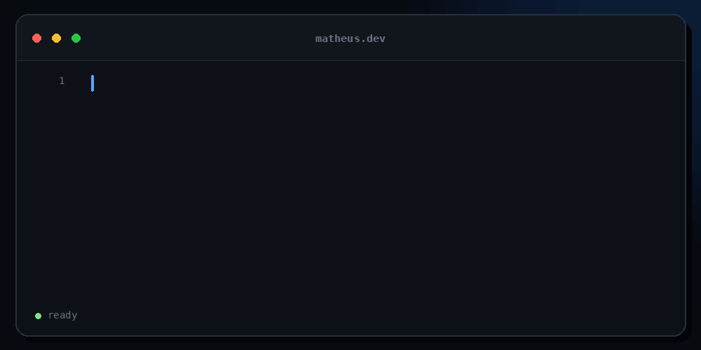

<div align="center">

  

  <h1>Olá, eu sou o Matheus 👋</h1>

  <p>
    <strong>Desenvolvedor Full Stack em formação</strong><br />
    Construindo aplicações completas, do banco de dados à interface.
  </p>

</div>

<br />

<h2 align="center">Tecnologias e ferramentas</h2>

<div align="center">
  <a href="https://skillicons.dev">
    
  </a>
</div>

<br />

```bash
$ git status

On branch fullstack-development

Backend       Java • Spring Boot
Frontend      React • TypeScript
Database      PostgreSQL
Tools         Docker • Git • GitHub Actions • Maven
Building      BarberBook
Learning      every single day
```

<br />

<div align="center">
  <code>code → learn → commit → repeat</code>
</div>
