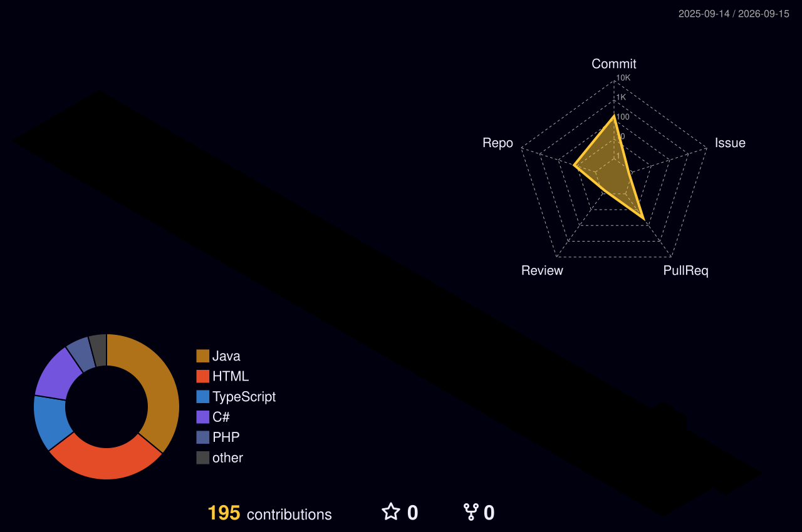

  

  <h1>Olá, eu sou o Matheus 👋</h1>

  

    <strong>Desenvolvedor Full Stack em formação</strong> 
    Construindo aplicações completas, do banco de dados à interface.
  

 

<h2 align="center">Tecnologias e ferramentas</h2>

  

 

<h2 align="center">Minha atividade no GitHub</h2>

  

 

  

 

  <picture>
    <source
      media="(prefers-color-scheme: dark)"
      srcset="./assets/github-snake-dark.svg"
    />
    <source
      media="(prefers-color-scheme: light)"
      srcset="./assets/github-snake.svg"
    />
    
  </picture>

 

  <code>code → learn → commit → repeat</code>

